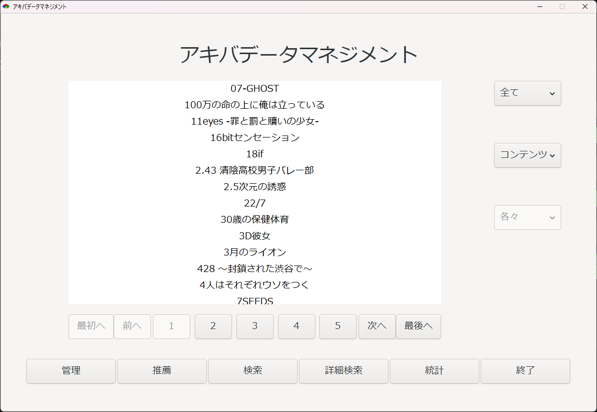
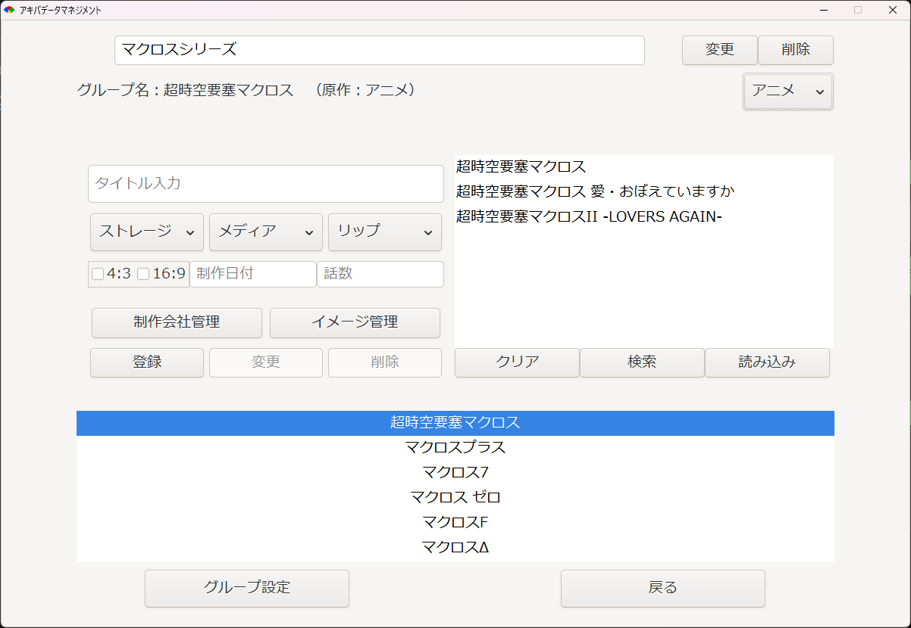
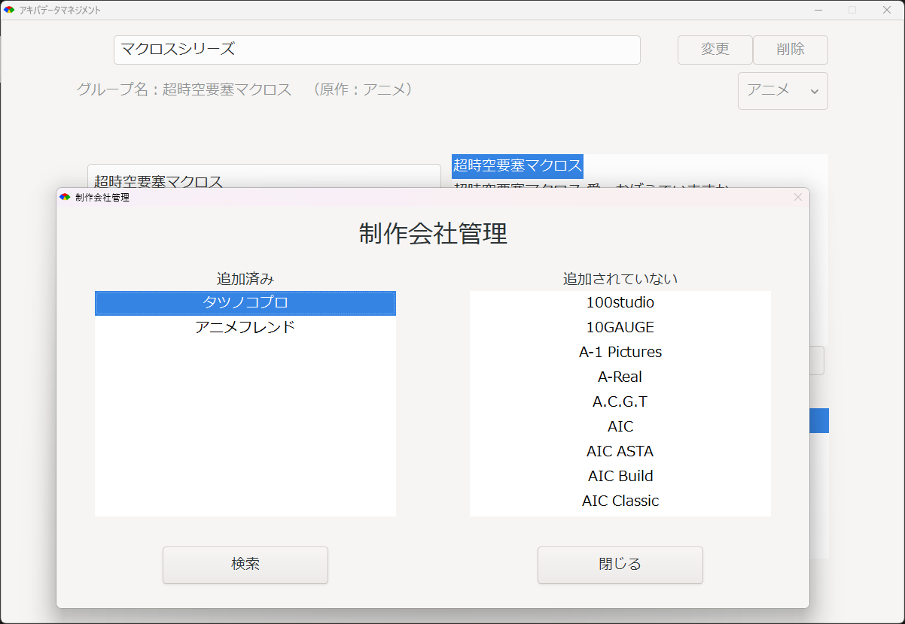
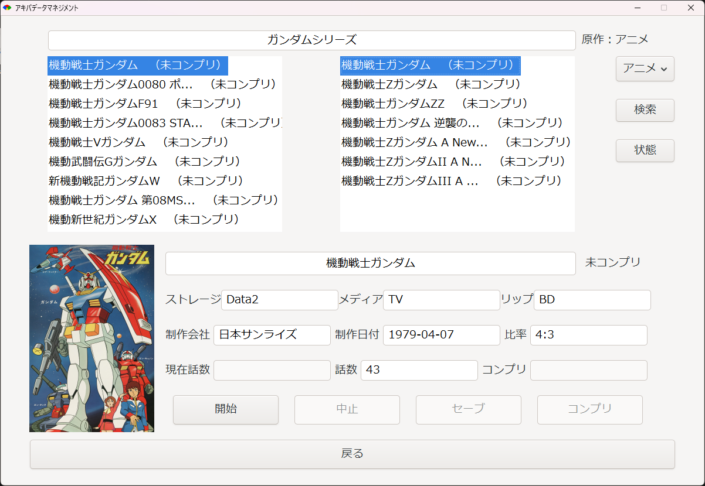
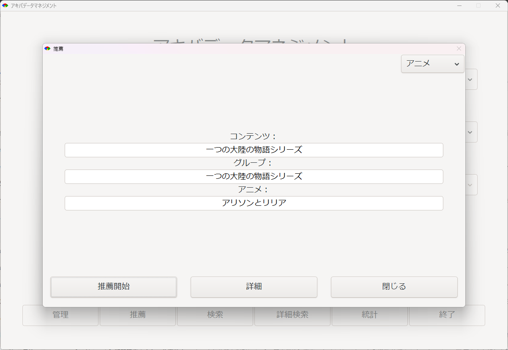

# AdManager

## 概要

アニメ、マンガやラノベなどの情報の管理ツール。

管理する情報の追加、更新、削除ができ、また情報の現状態（コンプリか否か）をチェック、及び変更（コンプリへと）できる。

### 💡 開発ポイント
- RubyでGTK3を動作させるため、MSYS2環境の構築からライブラリ設定までを自力で実施。
- GUI操作を中心に、CRUD（Create, Read, Update, Delete）と状態管理を実装。
- コード構成では、画面処理とDBアクセスを分離し、保守性を意識。
- SQLiteを用いてローカルデータを永続化。

### 🧩 主な機能
- タイトル・メディア・話数・制作会社などの登録・編集・削除
- コンテンツグループ管理
- コンプリ状態（完了・未完了）の切り替え
- 統計・検索・詳細検索・画像管理機能

### 開発環境及びフレイムワーク

このプロジェクトは下記の言語とフレイムワークで制作しました。

- **言語**: Ruby 3.4.3
- **フレイムワーク及びライブラリー**:
    - cairo: 1.17.13 (グラフィック描画ライブラリ)
    - ffi: 1.17.2 (外部関数インターフェース)
    - glib2: 4.2.1 (GLibライブラリバインディング)
    - gtk3: 4.2.1 (GTK+ 3 GUIライブラリ)
    - i18n: 1.14.4 (国際化サポート)
    - minitest: 5.20.0 (テストフレームワーク)
    - ostruct: 0.6.0 (OpenStructクラス)
    - rake: 13.1.0 (ビルド自動化ツール)
    - sqlite3: 2.6.0 (SQLiteデータベース接続)
    - standard: 1.32.1 (Rubyコードスタイル標準化)
    - win32-sound: 0.6.2 (Windows用サウンド再生)
    - bundler: 2.5.6 (依存性管理)


### 📷 画面イメージ
メイン画面


コンテンツ管理画面

（例: 「マクロスシリーズ」のコンテンツのアニメ管理画面）

会社管理画面


コンテンツ情報の詳細表示画面

（「ガンダム」のコンテンツのアニメを表示する画面、この画面で現状態の変更が可能）

コンテンツ推薦の画面

（ランダムにコンテンツを推薦する）

### インストール

`Ruby 3.4.3`をインストールしてから下記の通りに進む。

1. https://www.msys2.org/ でMSYS2をダウンロードし、インストールする。
2. ターミナルで下記のコマンドを入力する。
   ```bash
    ridk install
   ```
3. インストール画面が現れたら`MSYS2 and MINGW development toolchain`をインストールする為に`3`を入力する。
4. インストールが完了したら、`MSYS2 MSYS`ターミナルを実行してから、次のコマンドでアップデートに進む。
   ```bash
    pacman -Syu
    ```
5. 次に、RubyでGTK3を使用する為のライブラリーと開発ツールをインストールする。MSYS2ターミナルで次のコマンドを入力する。
   ```bash
    pacman -S mingw-w64-x86_64-gtk3 mingw-w64-x86_64-glib2
   ```
6. 最後に本プロジェクトでのライブラリーやフレイムワークを使用する為に次のコマンドを入力する。
   ```bash
    bundle install
   ```
7. プロジェクトとして`lib/ad_manager/apps/app.rb`を実行する。

### データベース

本プロジェクトではデータベースとして`sqlite3`を使用しています。

データベースの初期設定のために次のコマンドを入力してください。

```bash
    sqlite3 db/ad_db ".read script.sql"
```

### 💬 技術的説明
- GUIイベントは`Gtk::Builder`で定義し、Rubyクラスにバインド。
- SQLiteのクエリは`prepare`文を使用し、SQLインジェクション対策を考慮。
- レイアウトはBox・Gridを併用し、ネイティブ感ある操作性を重視。
- アプリの設定・データはすべてローカルに保存され、オフラインで利用可能。

### 👨‍💻 開発者コメント
> Webアプリケーションではなくデスクトップアプリとして設計した理由は、  
> オフライン環境でも素早く起動できるようにするため、  
> またRubyでのGUI開発経験を積みたかったからです。

---

**全て個人開発**で、設計・コーディング・テスト・UIデザインを一人で担当しました。
